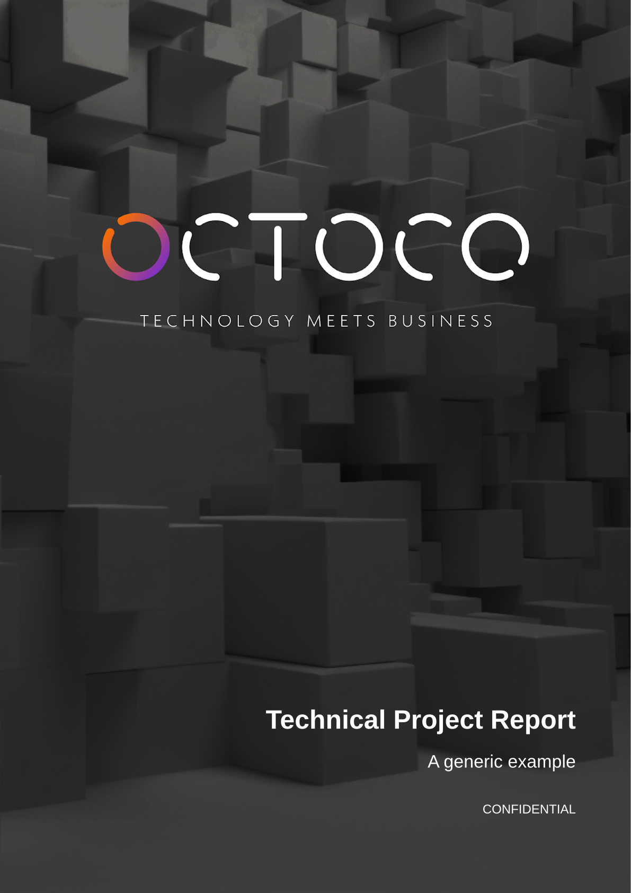
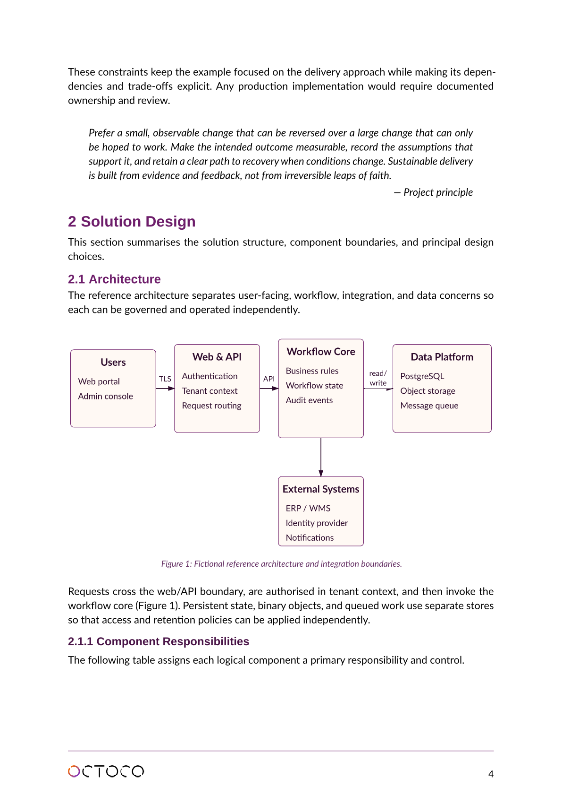

# Octypst

Octypst is a reusable [Typst](https://typst.app/) template for professional technical reports. Report structure and branding are separate: one structural template owns layout, typography, headings, footers, figures, notices, and helpers, while each brand file supplies its logo, cover artwork, and colors.

Two complete examples are included:

| Report | Brand definition | Output |
| --- | --- | --- |
| `sample_report.typ` | `octoco-report-brand.typ` | `sample_report.pdf` |
| `oai-sample-report.typ` | `oai-report-brand.typ` | `oai-sample-report.pdf` |

The Octoco AI brand uses the dark technical imagery, `OCTOCO.AI` wordmark, and blue palette from [octoco.ai](https://octoco.ai). Its footer logo is a dark-on-transparent variant so that it remains legible on white pages.

Typst documents are well suited to human and agent collaboration. Report content and layout are plain-text source files, so people can review focused Git diffs while coding agents can draft sections, update tables, or make consistent template changes. The PDF remains a reproducible build artifact rather than a file that must be manually merged.

## Report preview





## Quick start

### Prerequisites

- [Typst](https://github.com/typst/typst/releases) 0.13.1
- GNU Make

Clone the repository and build both branded samples:

```sh
git clone https://github.com/gvrooyen/octypst.git
cd octypst
make
```

Run `make clean` to remove generated PDFs. To compile one report directly:

```sh
typst compile sample_report.typ
typst compile oai-sample-report.typ
```

### Add the template to an existing Git project

Keep an Octypst checkout on your machine and expose its `bin` directory once:

```sh
git clone https://github.com/gvrooyen/octypst.git "$HOME/octypst"
export PATH="$HOME/octypst/bin:$PATH"
```

From the root of another project, create a self-contained Octoco-branded report folder:

```sh
new-report reports/design
typst watch reports/design/report.typ reports/design/report.pdf
```

The generated folder contains a minimal `report.typ`, the structural and Octoco brand templates, required assets, `OCTYPST-LICENSE`, and a `.gitignore` for PDFs. The command refuses to overwrite an existing destination.

## Use the structural template

Import the structural template and a brand, instantiate the template, and select the helpers the document uses:

```typst
#import "report-template.typ": report-template
#import "oai-report-brand.typ": oai-brand

#let template = report-template(oai-brand)
#let (
  report,
  cover-page,
  title-page,
  report-outline,
  h1,
) = template

#show: report.with(
  document-title: "Project Report",
  document-author: "Octoco AI",
)

#cover-page(
  title: "Project Report",
  subtitle: "Project subtitle",
)

#title-page(
  title-lines: ("Project", "Report"),
  prepared: "Prepared by Octoco AI",
  version: "1.0",
  author: "Project Team",
)

#report-outline()
```

The template also exposes `notice`, `callout`, `report-figure`, `checkbox`, `O`, `X`, `h2`, `h3`, `fig-caption`, `cite`, and `reference`. See either sample report for complete usage.

## Create or swap a brand

A brand file exports a dictionary with this shape:

```typst
#let example-brand = (
  logo: "assets/example-report/logo.svg",
  front-page-image: "assets/example-report/cover-background.png",
  colors: (
    heading: rgb("#123456"),
    subheading: rgb("#345678"),
    caption: rgb("#567890"),
  ),
)
```

- `logo` appears in the footer from page 2 onward.
- `front-page-image` fills the cover page behind its title and subtitle.
- `heading` styles level-one and level-two headings and primary accents.
- `subheading` styles level-three headings.
- `caption` styles figure and table captions.

To rebrand a report, import a different brand file and pass its dictionary to `report-template`. Report content and structural helpers do not need to change.

## Repository layout

| Path | Purpose |
| --- | --- |
| `report-template.typ` | Brand-neutral report structure and helpers. |
| `octoco-report-brand.typ` | Octoco logo, cover, and colors. |
| `oai-report-brand.typ` | Octoco AI logo, cover, and colors. |
| `starter_report.typ` | Minimal Octoco report copied by `new-report`. |
| `sample_report.typ` | Complete fictional Octoco example. |
| `oai-sample-report.typ` | Complete fictional Octoco AI example. |
| `bin/new-report` | Creates a self-contained report folder in another project. |
| `assets/*-report/` | Brand-specific assets. |
| `assets/sample-report/` | Illustrations shared by the samples. |
| `tests/table-alignment.typ` | Wrapped left/center/right table-cell regression fixture. |

## Font configuration

The portable defaults are Lato/Open Sans/Liberation Sans for body text, Liberation Sans for headings, and Liberation Mono for code. Override installed fonts through the Makefile when needed:

```sh
OCTOCO_BODY_FONT="Open Sans" \
OCTOCO_HEADING_FONT="Lato" \
OCTOCO_MONO_FONT="Liberation Mono" \
make
```

When invoking Typst directly, pass the equivalent `--input body-font=...`, `--input heading-font=...`, and `--input mono-font=...` options.

## Regression check

Run the complete build and table-layout regression check with:

```sh
make check
```

The check builds both sample reports and compares the rendered table fixture with its committed SVG reference. The fixture contains wrapped left-, center-, and right-aligned cells. This catches accidental reintroduction of inherited paragraph justification inside tables while preserving intentional table column alignment. Update the reference only after visually reviewing an intentional layout change.

## Human and agent collaboration

1. Keep report text, structure, and style changes in `.typ` files.
2. Review source diffs, especially facts, client information, figures, and approval language.
3. Run `make check` and inspect affected rendered pages before sharing.
4. Commit source and assets; do not commit generated PDFs.

## Building in Amp orbs

The repository includes `.agents/setup` for Amp orbs. A fresh orb installs the pinned Typst toolchain and open fonts, then verifies it can compile the sample report.

## License

This project is licensed under the [MIT License](LICENSE).
